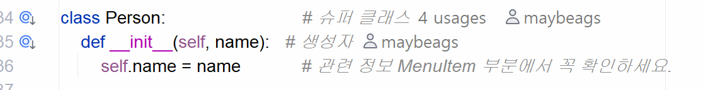

# 상속 복습 inheritance review

```python
class Person:
    def __init__(self, name):
        self.name = name
        
    def eat(self, food):
        print(f'{self.name}이(가) {food}을(를) 먹습니다.')
```
라고 정의하고, 이하에서 서브 클래스를 정의했었습니다.

```python
class Student(Person):
    def __init__(self, name, school):
        super().__init__(name)
        self.school = school

    def study(self):
        print(f'{self.name}이(가) {self.school}에서 공부를 합니다.')

# Student 객체를 생성

potter = Student('해리포터', '호그와트')
potter.study()      # Student의 고유 메서드니까 당연히 가능하겠네요
potter.eat('감자')    # Student 클래스 내에 직접적으로 정의되어 있지 않지만 슈퍼 클래스에서 그대로 사용 가능
```
그리고 맨 위의 이미지 파일에 주목해보시면 O 표시가 있습니다.
이 O의 의미는
**Override**의 축약어로 쓰였습니다.
method overriding이라는 개념이 존재합니다. 이는 부모 클래스의 메서드를 자식 클래스에서 _재정의_ 할 수 있다는 것을 의미합니다.

보통 자격증 시험에서 method overloading / overriding의 특징을 객관식 형태로 많이 물어봅니다.

# 기초 프로그래밍 언어 수강 이후 학습 계획
응시자 상황에 따라 취득할 수 있는 자격증
산업기사 - 2, 3년 제 졸 이상 -> 산업기사를 따고 관련 경력이 채워질 경우 기사 응시 자격 취득
기사 - 4년제 졸 이상
이렇게 '기사'라는 표현이 있는 시험들은 필기 - 실기로 이루어져 있습니다.
일반적인 경우 기사 자격은 국가 자격증에 해당하지만, 한국데이터진흥원에 해당되는 민간 자격증의 경우 IT 관련 기준으로 빅데이터분석기사가 있습니다.
- 최근에는 교재 구입이나 인강 등을 이용하여 학습할 필요가 있습니다.

https://www.comcbt.com/

유튜브 흥달쌤으로 저는 C 공부를 했습니다/ Java도 보긴했었는데 유료화되었습니다.

그렇다면 응시 자격 제한이 없는 민간 자격증 중 웹 개발자 - AI / 데이터가 됐든 범용성이 높은 자격증은 SQLD
그리고 SQLD가 있는데 좀 더 빅데이터 쪽으로 가고 싶다면 ADsP

AWS cloud practioner - 원래 의미는 아마존 웹 서비스에 대한 용어를 알고 있고 어떤 서비스인지 소개할 수 있는 자격

python 자체에서 굳이 여러분들이 기능을 공부하기 보다는 특정 라이브러리를 공부하는 것을 추천드리겠습니다. numpy

